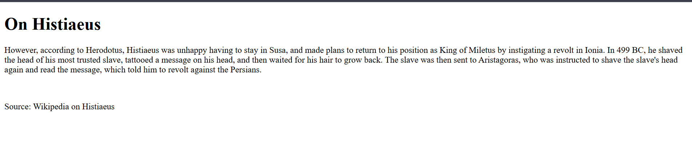

# Inspect HTML

## Description

> Can you get the flag?

## HINTS:

> What is the web inspector in web browsers?





Right-click → **View Page Source** (or press `Ctrl+U`) to see the raw HTML.


```html
<!--picoCTF{1n5p3t0r_0f_h7ml_1fd8425b}-->
```

Extracted the flag:

`picoCTF{1n5p3t0r_0f_h7ml_1fd8425b}`

The flag was placed inside an HTML comment. HTML comments are part of the page delivered to the browser and are trivial to view via “View Source” or developer tools, so any secret placed there is publicly exposed.

**Vulnerability / Lesson**
This is an *information disclosure* problem — sensitive data (the flag) was embedded client-side where anyone can read it. Never store secrets (flags, API keys, credentials) in HTML, JavaScript, or other client-side files.

**Mitigations**

* Keep secrets server-side only.
* Remove debug/test data and comments containing sensitive info before deployment.
* Use automated scans or CI checks to flag committed secrets (pre-commit hooks, secret scanners).

