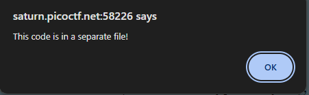
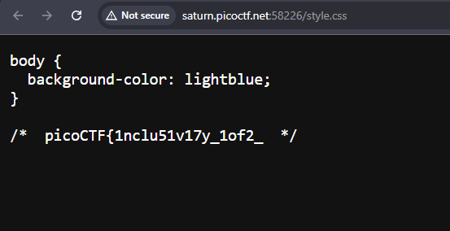

# Includes

## Description

> Can you get the flag?

## HINTS:

> Is there more code than what the inspector initially shows?

so that mean that we have to find other files 

Right-click → **View Page Source** (or press `Ctrl+U`) to see the raw HTML.

here we can see that there are two files `script.js` & `style.css` 

but that us not the full flag

we can also see the `script.js` file

boom we combine them both and get this flag:

`picoCTF{1nclu51v17y_1of2_f7w_2of2_df589022}`