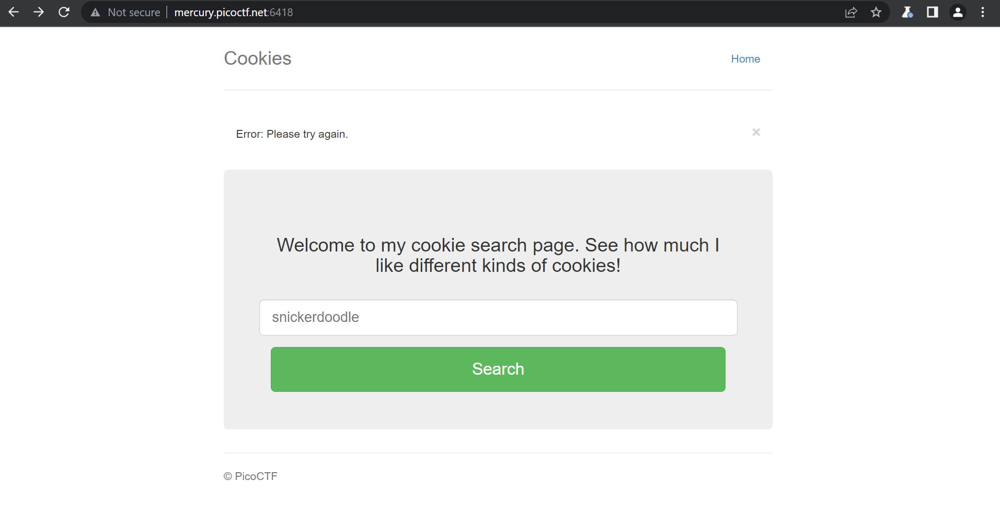
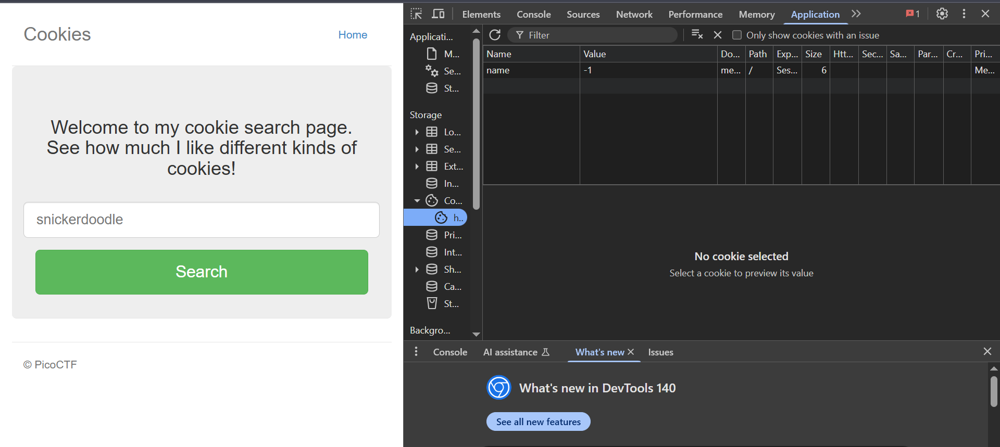
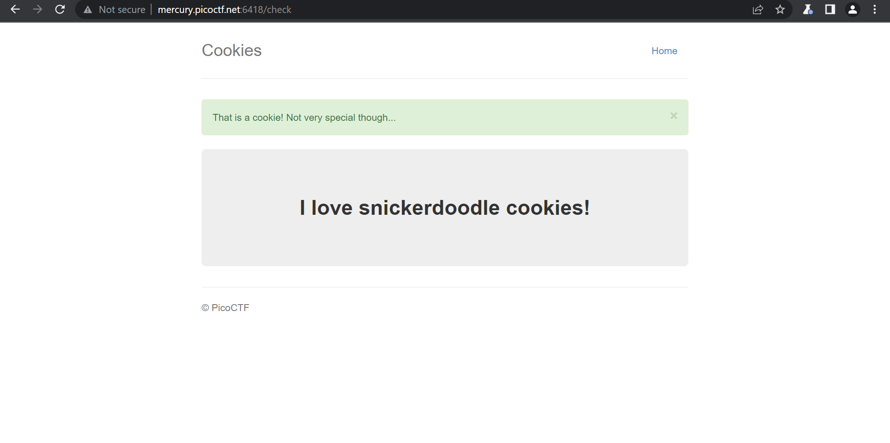
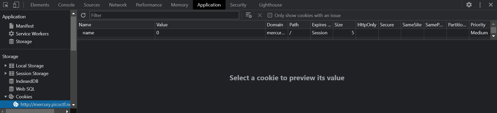
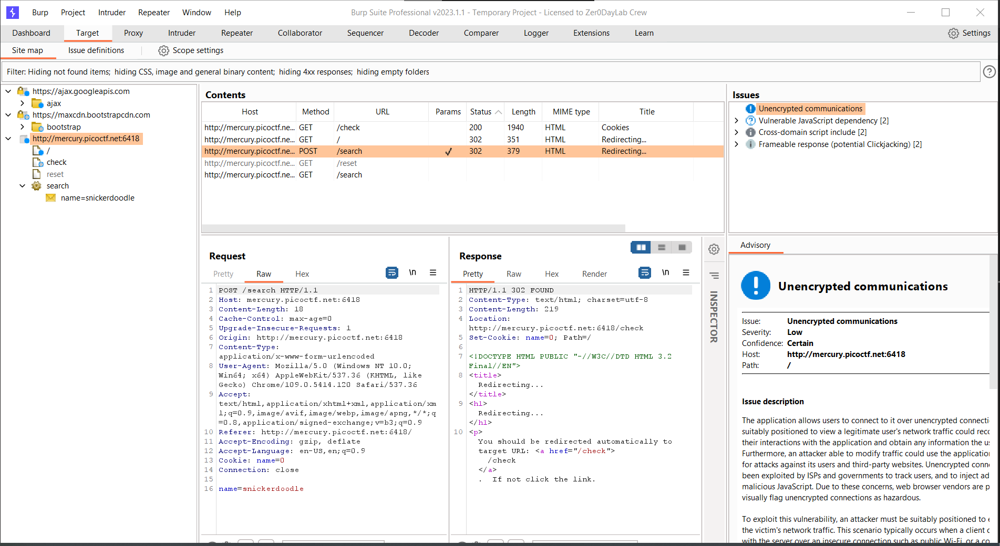
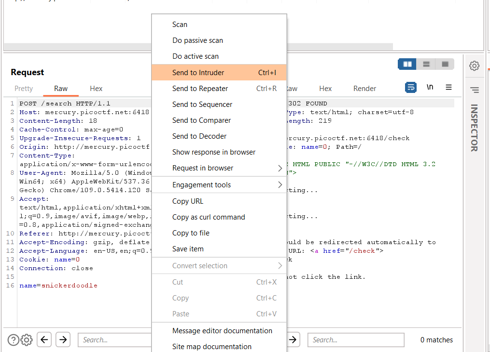
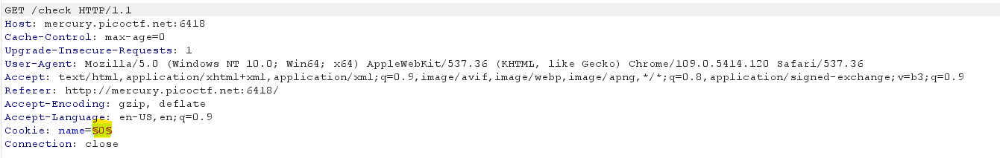
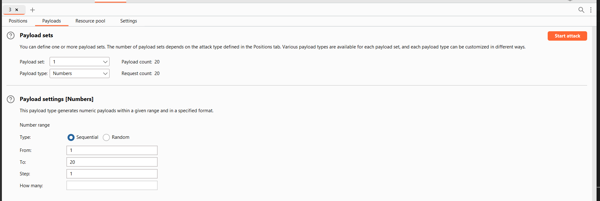
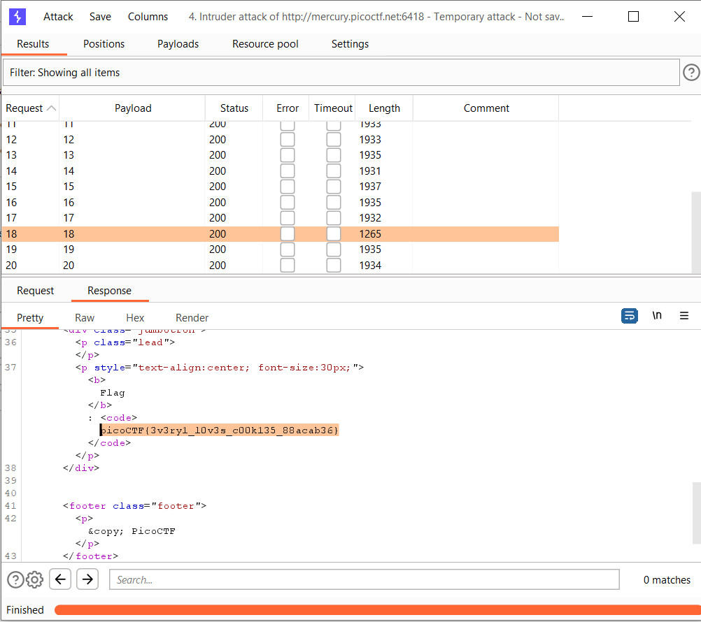

# Cookies

## Description

> Who doesn't love cookies? Try to figure out the best one. http://mercury.picoctf.net:6418/




lets look for cookies 🍪



here we can see that the cookie value is `-1` at the start

lets enter `snickerdoodle` 



now lets look into the cookies value 



lets open burpsuit



we will now bruteforce the value for which we will get flag

send the request to the intruder





now we can see 

```bash
Cookie: name=§0§
```

we are going to create an payload that makes request with this value changed

so if we are lucky we can get the right value 



this is the payload config that i am using

it will go from `1-20` and get the flag

click `start attack` and see the magic for your self

go through all the response for me it was at the `18`

