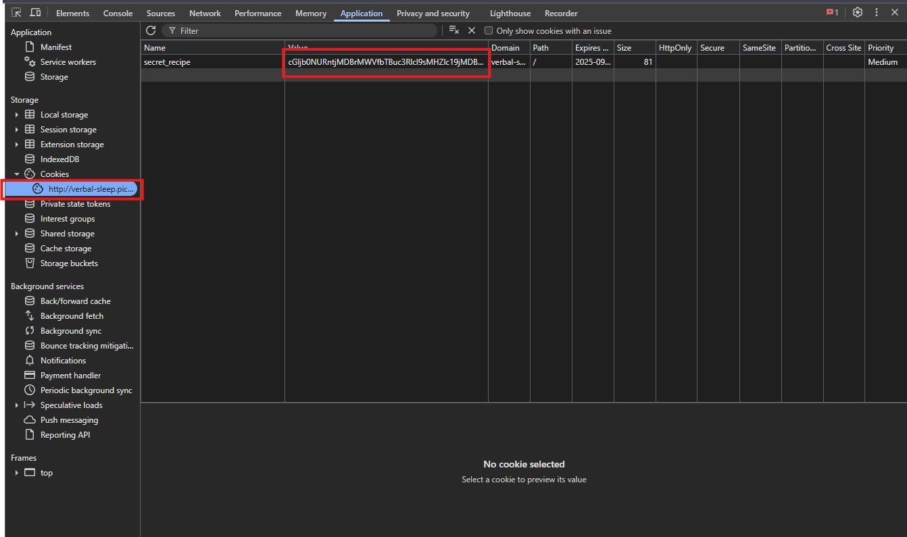

# 🍪 **Cookie Monster Secret Recipe**

## Description

> Cookie Monster has hidden his top-secret cookie recipe somewhere on his website. As an aspiring cookie detective, your mission is to uncover this delectable secret. Can you outsmart Cookie Monster and find the hidden recipe?

## HINTS:

>Sometimes, the most important information is hidden in plain sight. Have you checked all parts of the webpage?

>Cookies aren't just for eating - they're also used in web technologies!

>Web browsers often have tools that can help you inspect various aspects of a webpage, including things you can't see directly.


---


lets enter credentials


> hint: Have you checked your cookies lately?


## Inspect the Cookie

By opening the **browser DevTools → Application → Cookies**, we find the following cookie value:



we get this value

```
cGljb0NURntjMDBrMWVfbTBuc3Rlcl9sMHZlc19jMDBraWVzXzJDODA0MEVGfQ%3D%3D
```

---

## Decodeing

we will use [encoding.tools](https://encoding.tools/) to decode this 

### URL Decode

The string contains `%3D`, which is URL encoding for `=`.
After URL decoding, we get:

```
cGljb0NURntjMDBrMWVfbTBuc3Rlcl9sMHZlc19jMDBraWVzXzJDODA0MEVGfQ==
```

---

### Base64 Decode

The resulting string looks like Base64. Decoding it gives:

```
picoCTF{c00k1e_m0nster_l0ves_c00kies_2C8040EF}
```


---

## Final Flag

```
picoCTF{c00k1e_m0nster_l0ves_c00kies_2C8040EF}
```

do you know we can also do this by using [burpsuit](https://www.kali.org/tools/burpsuite/)


Copy the cookie value and paste it in the `Burp Decoder`.
Use `Decode as URL` > `Decode as Base64` to get the Flag value.

