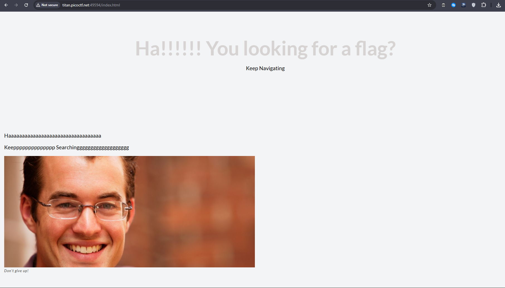
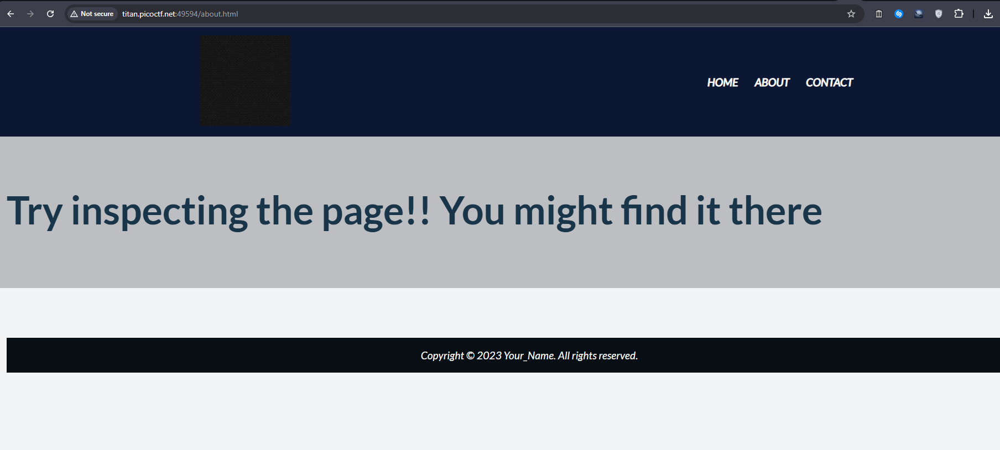
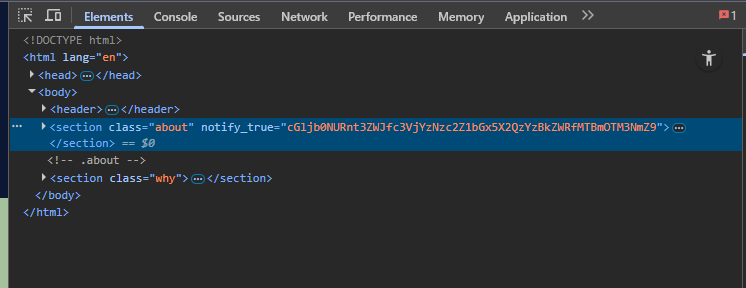
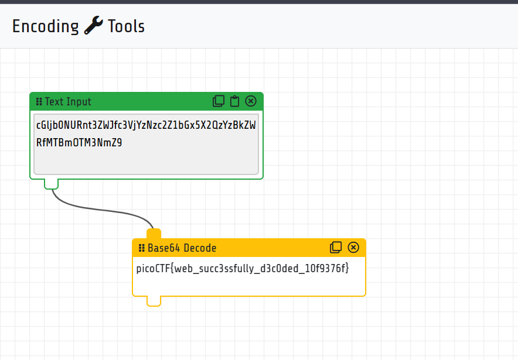

# **WebDecode**

## Description

> Do you know how to use the web inspector?

The challenge gives a webpage where the flag is hidden in the HTML. The goal is to locate the hidden flag, which is stored in a custom attribute of an HTML element.

---

## Inspect the Web Page




what an ugly looking home page 😐

lets nevigate to about page





> Try inspecting the page!! You might find it there

Using the **Web Inspector / DevTools**:

1. Open the webpage in your browser.
2. Right-click → **Inspect** (or press `Ctrl + Shift + I` / `F12`).
3. Look through the HTML elements for anything unusual.




We find the following snippet:

```html
<section class="about" notify_true="cGljb0NURnt3ZWJfc3VjYzNzc2Z1bGx5X2QzYzBkZWRfMTBmOTM3NmZ9">
```

Notice the custom attribute: `notify_true="..."`.

---

## Decode the Flag

i will use [encoding.tools](https://encoding.tools/)

The value in `notify_true` looks like **Base64**.

Value:

```
cGljb0NURnt3ZWJfc3VjYzNzc2Z1bGx5X2QzYzBkZWRfMTBmOTM3NmZ9
```

### Base64 Decoding

Decoding it gives:

```
picoCTF{web_succ3ssfully_d3c0ded_10f9376f}
```



---


