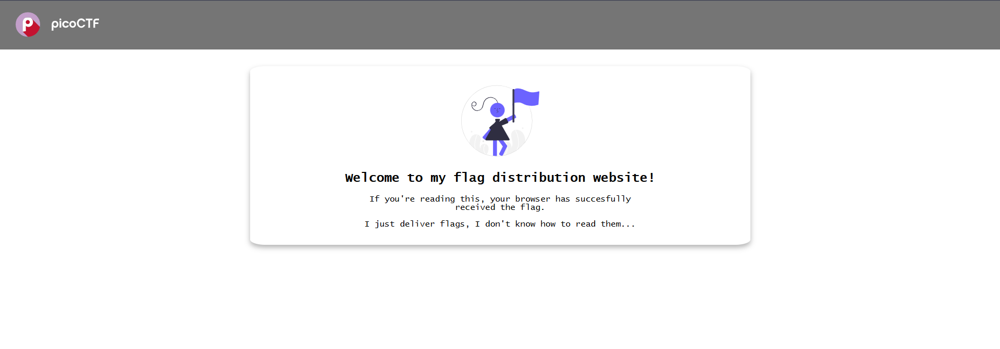
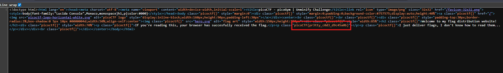
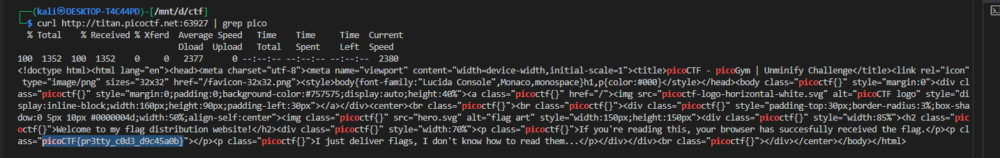
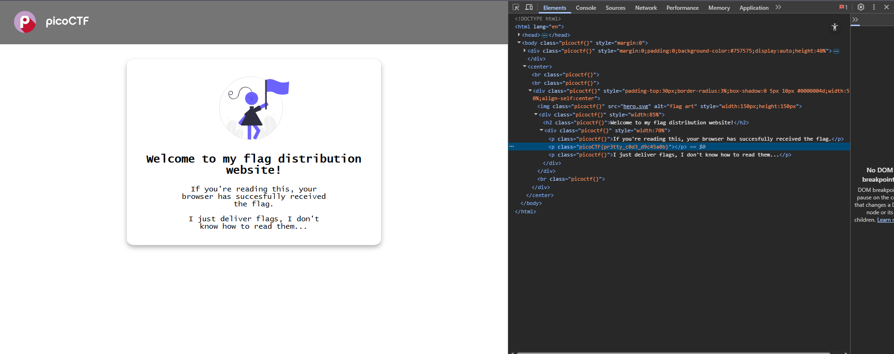
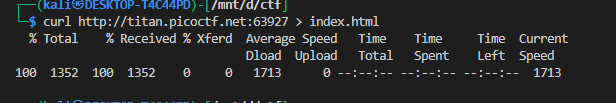
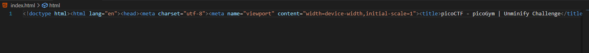
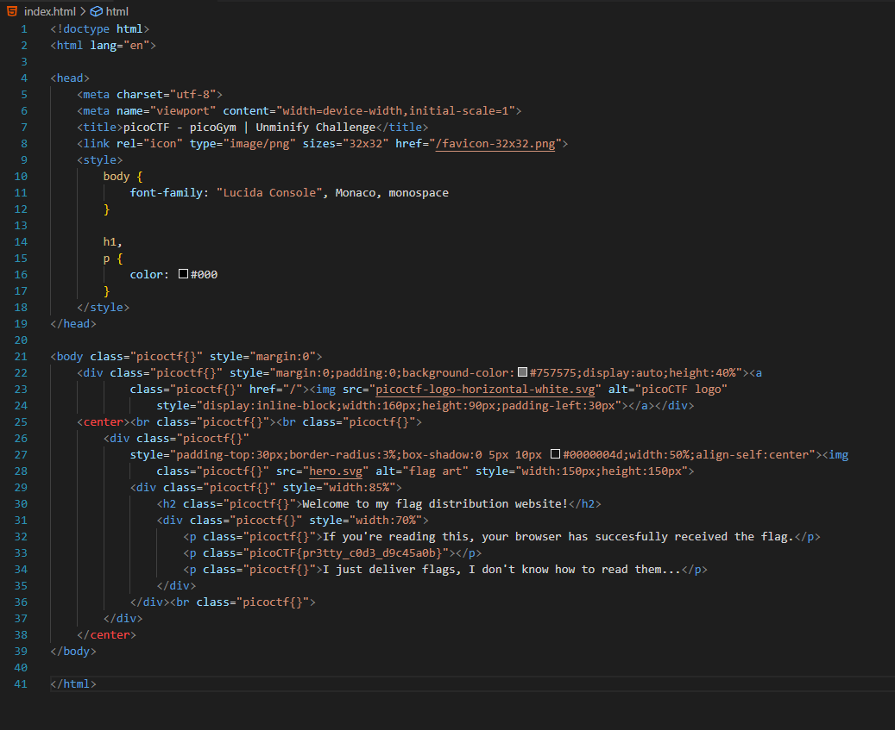
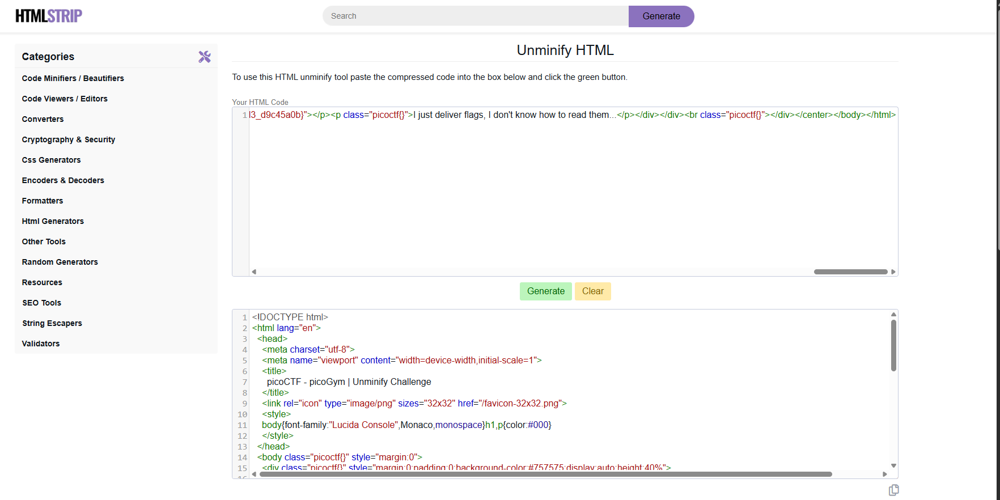

# Unminify

## Description

>I don't like scrolling down to read the code of my website, so I've squished it. As a bonus, my pages load faster!

## HINTS:

> Try CTRL+U / ⌘+U in your browser to view the page source. You can also add 'view-source:' before the URL, or try curl <URL> in your shell.

>What tools do developers use when working on a website? Many text editors and browsers include formatting.

> Minification reduces the size of code, but does not change its functionality.

what does this mean 🤔

Minification is the process of removing all unnecessary characters from code without changing its behavior. This is mostly done for JavaScript, CSS, or HTML to make the files smaller and load faster in the browser.


What gets removed?

- Extra whitespace (spaces, tabs, newlines)

- Comments

- Unnecessary semicolon or brackets in some languages

- Shortening variable names (in JS or CSS)

**Example**

Original HTML (readable):

```html
<p>Hello, world!</p>
<p>Welcome to picoCTF challenges.</p>
```

Minified HTML:

```html
<p>Hello, world!</p><p>Welcome to picoCTF challenges.</p>
```

The page still shows the same text, but the file is smaller.

**Why Minify?**

- Faster page load times

- Smaller file sizes → saves bandwidth

- Harder for humans to read → sometimes used to obscure code


---





lets use `ctrl+u` to ge the source of the page




here we can see Minification has cause the code to hard to read well but we have found our flag


**Fetch the Webpage**

We can fetch the webpage using `curl`:

```bash
curl http://titan.picoctf.net:63927
```

This returns a **minified HTML page**, making it hard to read manually.

---

**Search for the Flag**

Since picoCTF flags follow the pattern `picoCTF{...}`, we can filter the output:

```bash
curl http://titan.picoctf.net:63927 | grep pico
```

The result contains:

```html
<p class="picoCTF{pr3tty_c0d3_d9c45a0b}"></p>
```



---

**using Web inspector**



here we can see that the code given by the web inspector is more organized 


well here comes the hint 

>What tools do developers use when working on a website? Many text editors and browsers include formatting.


so the ans is vscode 🤷‍♂️

we can also use exteensions such as prettier but i thik new vs code has already preinstalled

we use curl to directlly copy the code to index.html file





press `Alt+Shift+F` to get more readable code




we can also use [unminify](https://www.htmlstrip.com/unminify-html) to do this 


