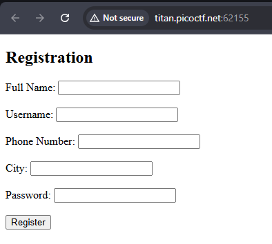
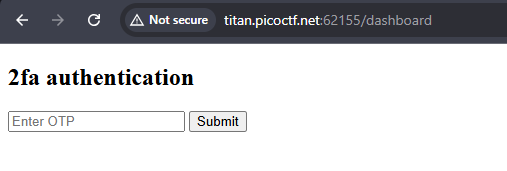
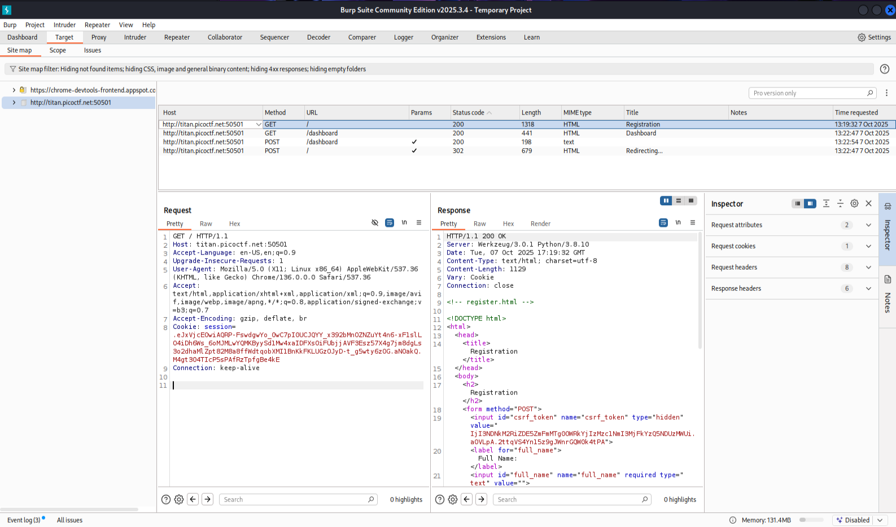
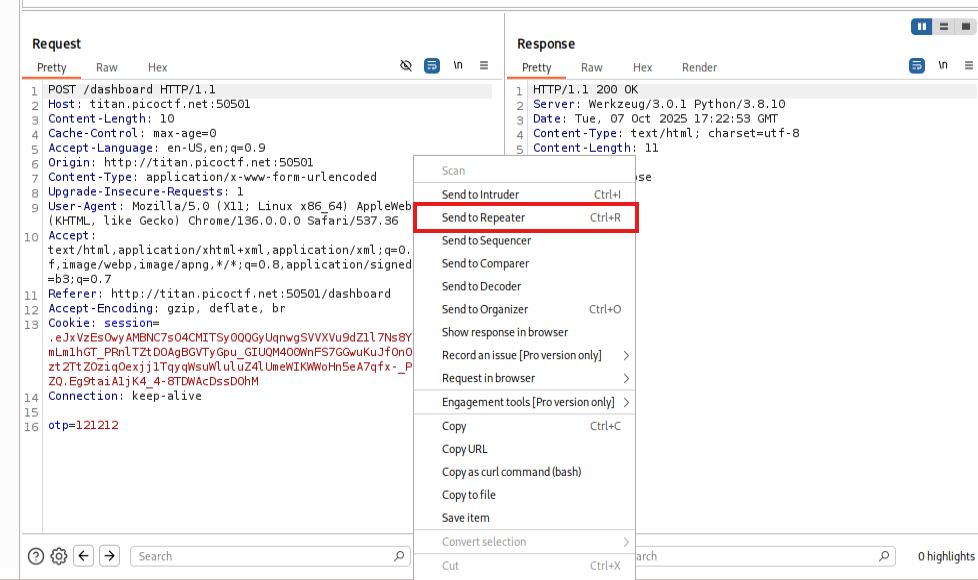
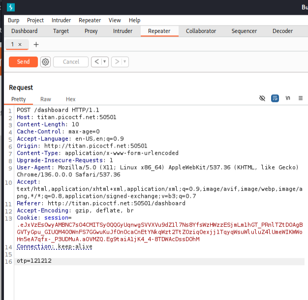
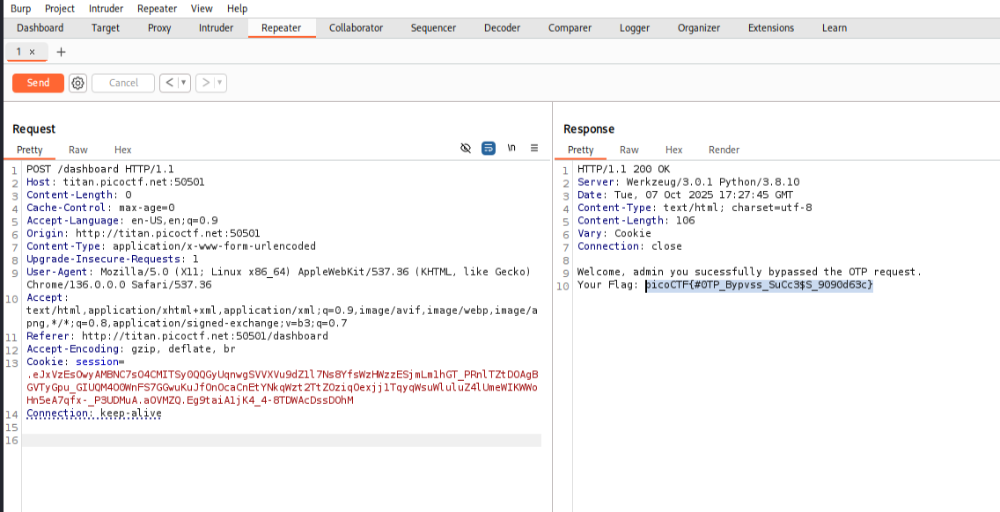

# IntroToBurp


**Challenge**: page asks for credentials and `otp` and give flag if otp is right




it then asks for `otp`



lets just use brupsuit to get the flag 😊





Provide any random value as OTP and click on the Submit which will show a message as “Invalid OTP”.

now we will sendthe request to the `repeater` in burpsuit








one way we can do is that we can brute force it but here hint can come handy 

> Try mangling the request, maybe their server-side code doesn't handle malformed requests very well.


You have **two POST requests** to `/dashboard`:

#### ✅ Working one:

```
POST /dashboard HTTP/1.1
Content-Length: 0
```

→ **No body** (empty request)

#### ❌ Non-working one:

```
POST /dashboard HTTP/1.1
Content-Length: 10
...
otp=121212
```

→ **Has a body parameter** (`otp`)

---

### 🧠 Why the first (empty) POST works

Even though `POST` usually carries data, **an empty POST is still valid**.

The key is:

> Some web applications handle a missing POST body as a **special case**, especially if developers forgot to validate it properly.

So when you send:

```
Content-Length: 0
```

the backend might:

* Skip validation code (because there’s no form data)
* Treat it as a **default/admin request**
* Or **fall into a debug/error path** that leaks sensitive information like the flag

In other words, the backend could look like this:

```python
@app.route('/dashboard', methods=['POST'])
def dashboard():
    otp = request.form.get('otp')
    if not otp:
        # forgot to secure this
        return FLAG
    elif otp == '1234':
        return 'Access Granted'
    else:
        return 'Access Denied'
```

→ When `otp` is missing (empty body), the first `if not otp` branch triggers and **reveals the flag**.

---

### 💣 Why the second (with `otp=121212`) fails

When you include:

```
otp=121212
```

the server receives a **non-empty form body**, so:

* It enters the next condition (`elif otp == '1234'`)
* But since `121212` is wrong, you get **“Access Denied”**
* You don’t hit the vulnerable branch

---

